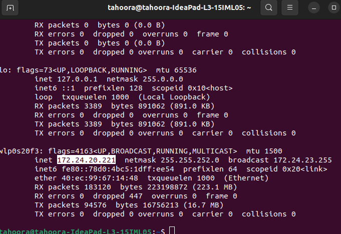

In this sesssion we have:
- [How to become a 10X engineer](#how-to-become-a-10x-engineer)
- [Linux apps](#linux-apps)
- [linux commands](#linux-commands)
- [What is my IP address?](#what-is-my-ip-address)
- [Static file serving and directory listing](#static-file-serving-and-directory-listing)
- [Git](#git)
- [Books to read](#books-to-read)

# Cheatsheets
* [git](https://education.github.com/git-cheat-sheet-education.pdf)
* [markdown](https://github.com/adam-p/markdown-here/wiki/Markdown-Cheatsheet#links)
* [linux]()
* [vim](https://devhints.io/vim)

# How to become a 10X engineer
To be a good and great engineer you need to do some self-improvements. An improved memory is one of those. To do so you can use Spaced Repitition method. Some softwares help you to use this technique like Anki. Find the links below to read more about this improvement and how to download Anki and also use shared decks to import in Anki software.

## Spaced Repetition

- [The translation of the article](https://virgool.io/Quera-Mag/%D8%AD%D8%A7%D9%81%D8%B8%D9%87-%D8%B1%D8%B4%D8%AF-%D9%81%D8%B1%D8%AF%DB%8C-%D8%A8%D8%B1%D9%86%D8%A7%D9%85%D9%87-%D9%86%D9%88%DB%8C%D8%B3-e64f7p51dm3x)
- [The original one](https://senrigan.io/blog/chasing-10x-leveraging-a-poor-memory-in-software-engineering/)

## anki
Anki is a program which makes remembering things easy.
- https://apps.ankiweb.net/
- https://ankiweb.net/shared/decks/
- https://ankiweb.net/shared/info/283705201
---

# Linux apps
We want to introduce some great linux apps each session.

## Yakuake
Yakuake is a drop-down terminal emulator based on KDE Konsole technology. 

To install you can use the following command:
```
sudo apt install yakuake
```

## htop
htop is a cross-platform interactive process viewer.

htop allows scrolling the list of processes vertically and horizontally to see their full command lines and related information like memory and CPU consumption. Also system wide information, like load average or swap usage, is shown.

The information displayed is configurable through a graphical setup and can be sorted and filtered interactively.

Tasks related to processes (e.g. killing and renicing) can be done without entering their PIDs.
[[images/htop.png]]

--------
# linux commands
- [40 most-used linux command](https://kinsta.com/blog/linux-commands/)
- ls 	Lists the content of a directory
- pwd 	Prints the working directory
- cd 	Changes directory
- cp 	Copies files and directories
- rm 	Remove files and directories
- mv 	Moves (renames) files and directories
- mkdir 	Creates directories
- man 	Displays manual page of other commands
- touch 	Creates empty files
- exit 	Exits the current shell session
- sudo 	Executes commands as superuser
- shutdown 	Shutdowns your machine
- htop 	Displays processes and resources information
- apt, yum, pacman 	Package managers
- echo 	Displays lines of text
- cat 	Prints file contents
- ps 	Reports shell processes status
- kill 	Terminates programs
- ping 	Tests network connectivity
- vim 	Efficient text editing
- history 	Shows a list of previous commands
- less 	Inspects files interactively
- tail 	Displays last lines of a file
- head 	Displays first lines of a file
- grep 	Prints lines that match patterns
- wc 	Word count files
	`cat test.txt | wc -l` --> number of lines in test.txt
- `tree`
---
### ways to see all of the commands that you have entered:
- with up/down key
- `history`
- `cat ~/bash_history.sh`
- ctrl + r ---> reverse searching among entered commands
- ctrl + shift + r ---> searching in order among enterd commands

### killing a program with cmd
```
kill p_id
```
killing the program by force
```
kill -9 p_id
```
### getting the program id 
of a program like 'golden'
```
ps | grep golden
```

### getting all programs that are using port 8000
```
lsof -i:8000
```
## What is my IP address?

### getting your private IP address
The following commands will get you the private IP address of your interfaces:
* `ifconfig -a`
* `ip a`



### To get your public IP
The following commands will get you the IP address list to find public IP addresses for your machine:
* `    curl ifconfig.me`
* `    curl -4/-6 icanhazip.com`
* `    curl ipinfo.io/ip`
* `    curl api.ipify.org`
* `    curl checkip.dyndns.org`
* `    dig +short myip.opendns.com @resolver1.opendns.com`
* `    host myip.opendns.com resolver1.opendns.com`


# Static file serving and directory listing
## http.server in python
- https://stackoverflow.com/a/55053143/11140790
- ```python -m http.server 8080 --bind 127.0.0.1 --directory /path/to/dir```
or
```python -m http.server --directory web```
- then you can share it with  --> http://your-ip-address:8000

## serve in nodejs
Powerful server for Node.js that just works so you can focus on your awesome project.

- installation
```
npm i serve --global 
serve
```
- To run the serve in a different port:
```
serve -l port-number
```

- If there is an index.html file where we are serving, you see its content by default.
- You can use it to move some static content like files from one computer to another (which can access your ip)

----

## Golden dictionary
iGoldenDict is a free and open-source dictionary program that gives translations of words and phrases for different languages. It allows the use of several popular dictionary file formats simultaneously and without conversion. 

You can find some dictionaries searching this in a search enginne : *download bgl dictionaries for babylon*

## A book for vocabulary improvement
- 1100 barrons

---

# Git
### adding ssh key for cloning with ssh
[source](https://docs.github.com/en/authentication/connecting-to-github-with-ssh)
1) Generating ssh key
	```
	$ ssh-keygen -t ed25519 -C "your_email@example.com"
	```
2) copy the generated file
	```
	cat ~/.ssh/id_ed25519.pub	
	```
3) paste it in this path:
	settings /  SSH and GPG keys / new ssh key

### git cheatsheet
https://education.github.com/git-cheat-sheet-education.pdf

### creating new branch
```
git checkout -b new_branch
git push --set-upstream new_branch
```
### deleting a  branch
`git branch -d <branch>`

--

# Books to read
## python
1.   Distilled python by David M. Beazley


2.   Fluent python by Luciano Ramlho


## Javascript
1. You dont know js [Kyle Simpson]


2. The definitive guide js david flanagan


